# **Assessment Analysis**

## Analysis Scope

* Assessment - https://docs.microsoft.com/assessments/.
* PageView - PageView data for Assessment.
* Referral - Referral Link for Assessment PageView
* Question Answered - Question Answered for Assessment
* Scoring - Scoring for Questions

## Traffic Analysis

The Traffic of October keeps falling if we observe the data before October 11th and estimate the entire monthly data with it. The September traffic have a slight drop of 8%, and October keeps the trend. The monthly UV of October is 9727 while the monthly PV is 74360. The drop rate of UV decreased from **8.5%** to **5.1%**, and the PV decrease rate shift from **7.8%** to **2.3%**.  

Since the October's data is still much higher than June and dropping speed is already slowed down, the future trend would possibily stablize if November and December's data is still above 8000. Future data is needed for further analysis.

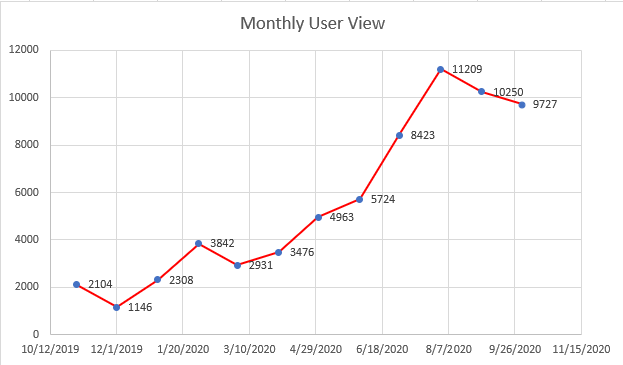

## Distinct session visits 

The number of sessions user visits is still rising, and the trend is steady and comforting. The rising trend starts in February 2020 and now the number is about 7 times bigger than the number in February. The rising of the trend is slowing down from September to
October, which shifts from **18.2%** to **10.7%**, implies the trend is turning steady. Further data is need, and at the end of the year the trend would be clearer.

Comparing the UV change and Session count trend, one conclusion could be made: fewer people start to visit the assessment page while the users are viewing more sections. This is an identical sign of the entire assessment that has reached the end of its growing stage. There are fewer and fewer new users who are willing to take theses assessments, and the old users would not visit the old assessments they have finished once more. Further data is also needed to prove this trend in the next two months.

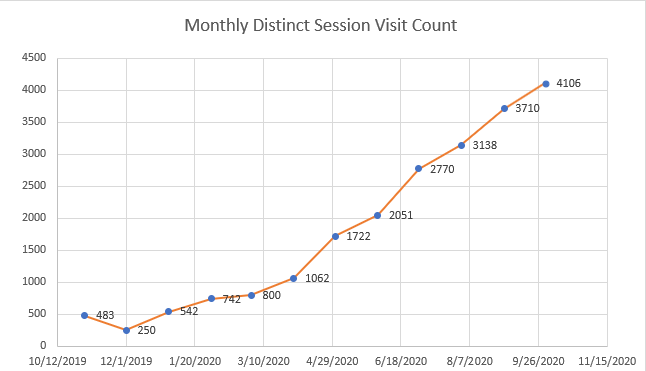

##  Referral Traffic

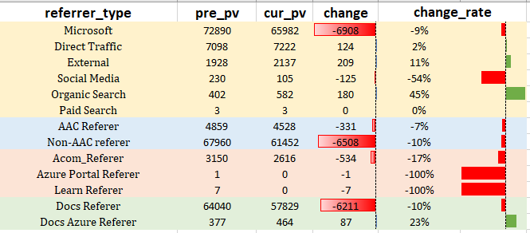

The overall referral decreased from August to September. Docs referrer, which means that the referral link is from Docs.Microsoft.com decreased for 9% percent, which is higher than traffic decrease. In comparison, referral links from external links and organic search increase. However,
since they are about 1% of internal referral link, the overall traffic is still decreasing and this helps validate the previous conclusion: the link and the section is still healthy, it is just reaching the middle of its life circle.

## Conversion rate of each stage and Detailed Analysis of Recommendation

The visitor conversion rate of all the history data of the Assessment section is shown below. The Conversion rate of all visitors into pre-assessment is 76.9%, while only **53.7%** of these users started the questions. During the test, **44.2%** of these users stayed to the final, and only **24.8%** of those users who finished the test clicked the recommended link. Comparing to the performance before June, the answered user rises **from 35% to 41%**, which is an enormous success. Also, the user who finished questions also rises from **16% to 18%**. Overall, the performance of assessment is rising.

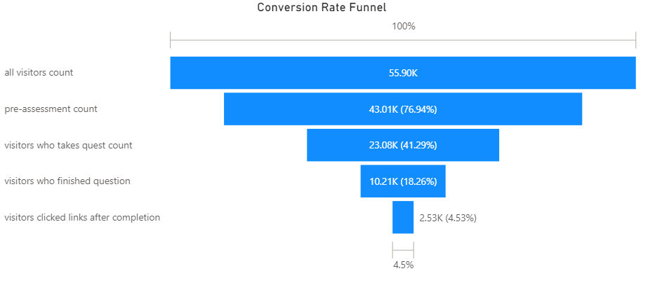

After careful examine of the data, we figured that the url is different for signed-in and not signed-in users in the database. For signed-in users, the url contains a session ID which is empty for those users who have not signed in before finished the assessment. After splitting the users apart, we observed that the signed-in users are more interested in clicking the link in the guidance page, no matter the Recommendation link or the Next-Step link. The data reveals that those signed-in user have more loyalty to the Assessment and are more willing to view more content even they have smaller total number than those user who prefer not to sign-in. In the perspective of user stickiness, the signed-in users are more sticky and have more possibility of converting into core users of Assessment.

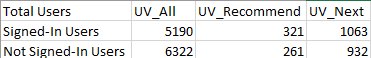

## Conversion Rate and Recommendation Analysis in three main sections

The conversion rate of each section is shown below separately.The participation rate of CJT and Strategy session is higher than AAR. The finish rate has the same situation. Considering the AAR contributes to the major traffic, the answer is reasonable. The recommendation rate could not be calculated separately due to data structure. To sum up, the funnel implies the improvement of the latest version of Assessment.

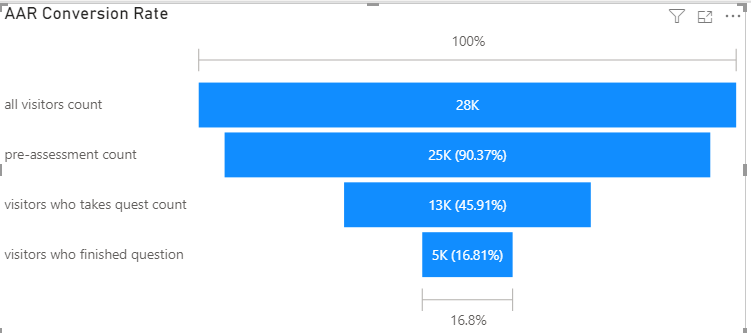

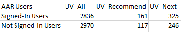

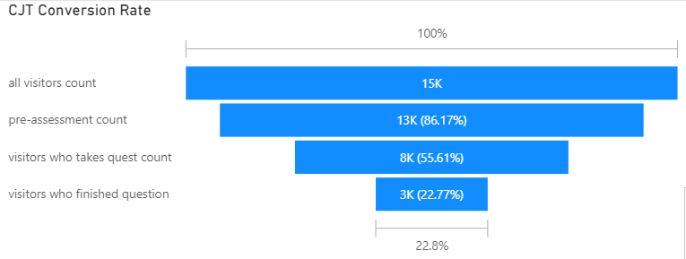

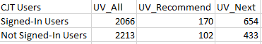

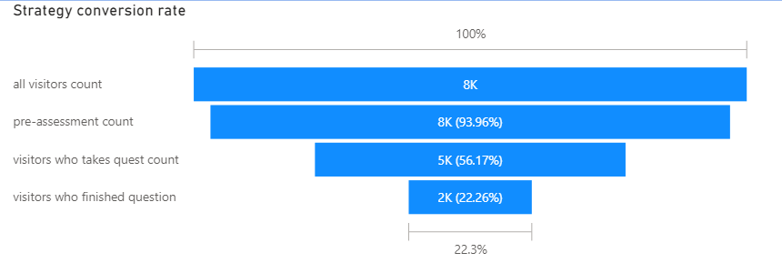

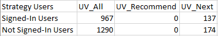

Overall, the two main section follow the previous trend. AAR and CJT both have the trend of signed-in user tend to click on Recommendation link and Next-Step link more even though their total amount is smaller. The difference among CJT users are more significant. Users of Strategy appears as the opposite of this trend, but considering the total amount of these users is relatively small and none of them clicked Recommendation link, the data could be regard as not significant if the target of analysis is users' performance in the Assessment. 

## Performance of three different sections

The three main parts of Assessment are Azure Architecture Review, Cloud Journey Tracker and Strategic Migration Assessment and Readiness Tool.
However, due to the update of the Assessment section, the CJT and AAR have new questions as well as new sections. To count the UV throughout history, we managed to count the previous version as well as the latest version. The UV of AAR contributes half of the total UV, and CJT new as well as CJT old contributes 32%. For the record, the new CJT consists
**23.2%** of the total UV and the old CJT only have 8.8%------which means that the new CJT exceed the Strategy section single handed. The trend for
this innovation is really going well.

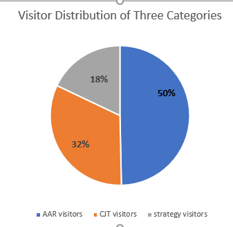
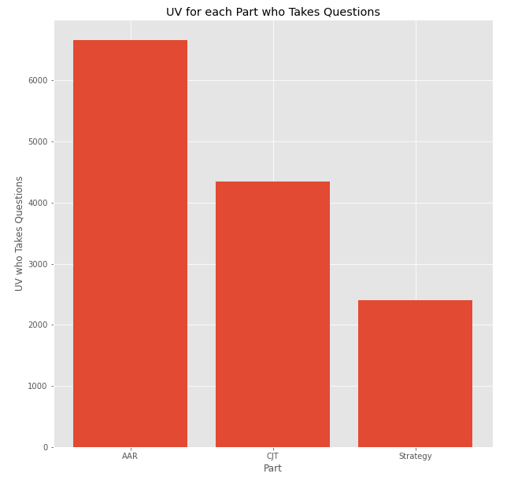

## Completion Rate in each section

**The rate is calculated by dividing the user count whose further reach is this specific question by the entire user who has started doing this part of assessment.**

In each section, there are different sets of questions which
contain questions about different topics. The five old main topics of AAR: **Cost**, **DevOps**, **Scalability**, **Security** and **Resiliency**'s performance is shown below. 

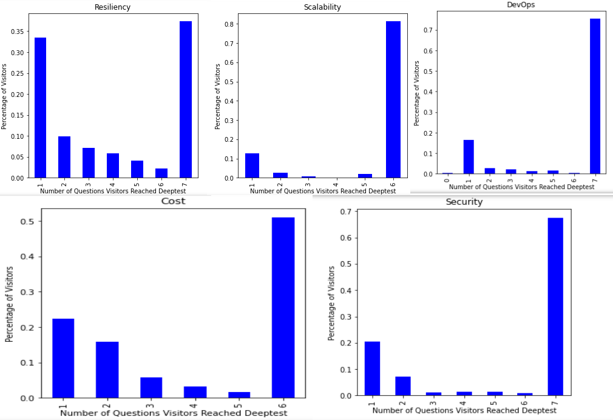

The Completion of them is shown by the last bar, which is 50%, 75%, 80%, 68% and 38%. The performance is all relatively good except Resiliency, which has a low finish rate. 

The latest version of AAR, which consists of **Cost**, **Operational**, **Performance**, **Security** and **Reliability**, all have a better performance on completion rate. The three new section (Operational, Performance, Reliability) have rate higher than 45%, and
two of them are really high(\>62%).

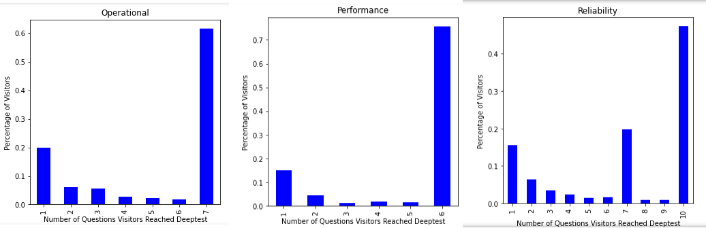

The second part is old CJT, which is an entire
section and has multiple questions. The completion rate is 41%, but since it has 28 questions the rate is okay.

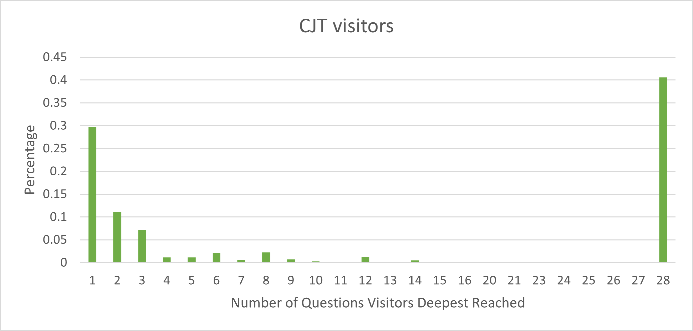

Next part, in comparison, is the new CJT. The complete rate becomes higher after the questionnaire is shortened. The result proves that this revision of CJT is indeed an improvement.

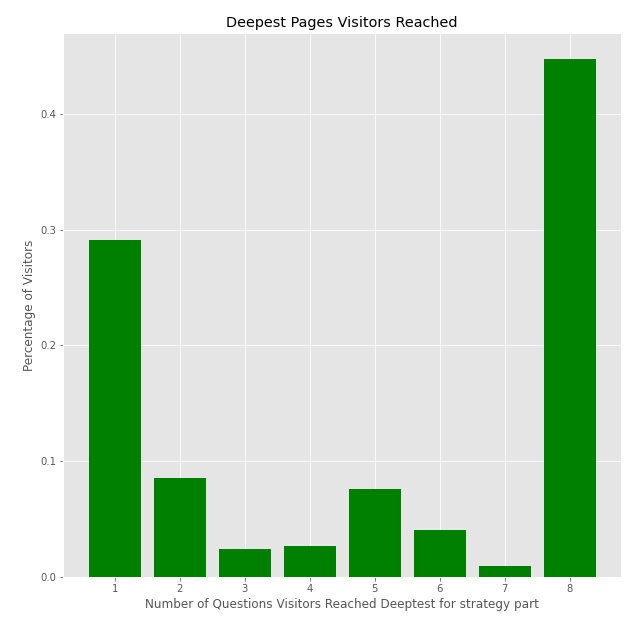

The last part, Strategy, is just like CJT. The 42% completion rate of a 17 question-long quiz is also a reliable performance for a long quiz. 

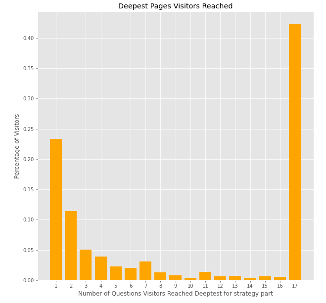

## Scores of Each Section

Due to the uncertainty of scores in the database, the analysis chooses the scores having "master" in "QuestionChoiceKey" as sample and ignored those
users whose answers have null score in the system. The outcome could be revised after the new scoring data is finalized.

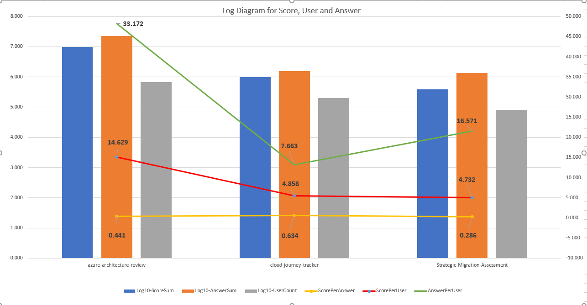

The Blue Bar is the log10 of total score acquired in this section, and orange bar is log10 of total question answered. The log10 of user amount of these three sections is shown as grey bars. The actual number is also printed below.

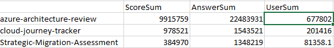

The lines are the Answer per User, which AAR is extremely high and CJT is the lowest; the Score per User which AAR leads the rest two; and Score per Answer which tells us that Strategic is the hardest part and CJT is the part which have the highest score per answer.

The conclusion matches the previous analysis.

## Scores of Different Questions

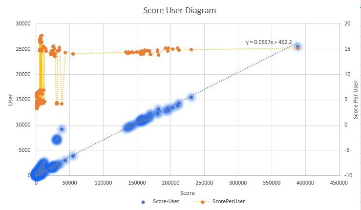

The score was counted question by question in the recorded, and the statistics are given after data cleaning. Meanwhile, the orange dot and the line show the distribution of Score-per-User. The huge part of total score obeys the trend line of y=0.0667x + 462.2, which implied the approximate relationship of y and x: x=15y. Comparing that with the distribution of Score per User, which is the orange line, the trend is confirmed: most of the orange dots are around 15, and some of the orange dots are around 5 (which is the outliers of blue dots). To sum up, the scoring distribution is divided into two groups: **15** and **5**.

The chart shows more detailed information on scoring situation: the question of Cost category got the most total scores as well as large amount of User, which means that it is the most popular session. The other popular sessions are: Reliability, Security, Operational and Performance. The other part of AAR has low scores. In fact, the latest version of AAR has been proven to be successful in the Scoring aspect.

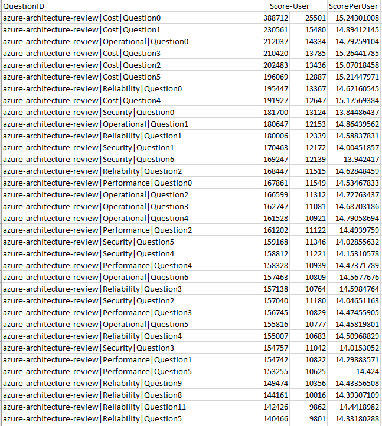

The average score of CJT and Strategy is low. Most of them stuck at the "5" part when we are looking at Scoring per User. The most outstanding Score per user happened in the CJT category and Resiliency Category, which are no longer in the current CJT assessment. The strategy section has a lower score and the one with the highest SPU is also CJT.

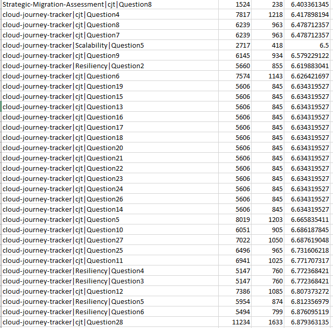

When evaluating the SPU, the highest in AAR is also the CJT category. The second highest is Resiliency. However, when we are evaluating scores, it is not necessary that the higher the score the better. The new AAR has not only a high SPU, but also a higher total score as well as user. 
Compared with the previous version, a conclusion could be made: the old AAR is too easy for the users, because they have high SPU and low visits.

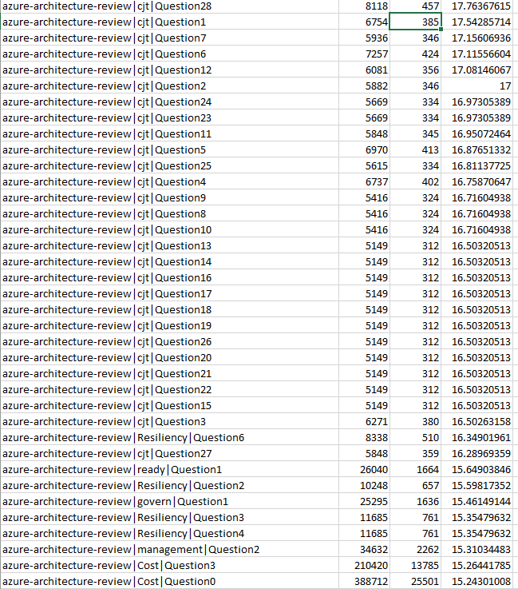

## Conversion Rate in different Device

The conversion Rate in each device give us another perspective evaluating the performance of Assessment in different platform. Overall, the PC user's conversion rate is about the same as the overall conversion rate previously presented. The users in other devices have
somehow lower conversion rate each stage. The **iPhone** users have the lowest conversion for every stage, which implies some problem behind. iPad users have the closest rate compared to PC users, and it makes us think about the reason behind. 

The most obvious reason behind this situation is that iPad has a larger screen compared with mobile devices. Does that mean the assessment is easier to take on a larger screen? Based on common sense, the conclusion is yes, and that gives the Assessment team another challenge: could we improve the website on the phone so that mobile users could also have a pleasant experience in taking the questions so that the conversion rate would be higher in the future?

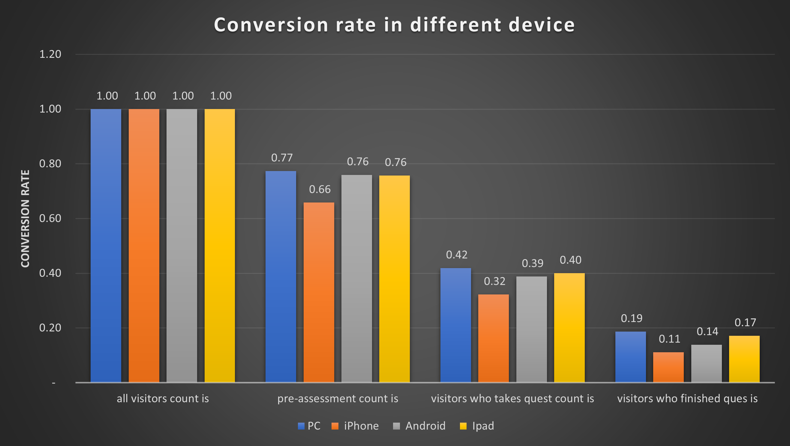
